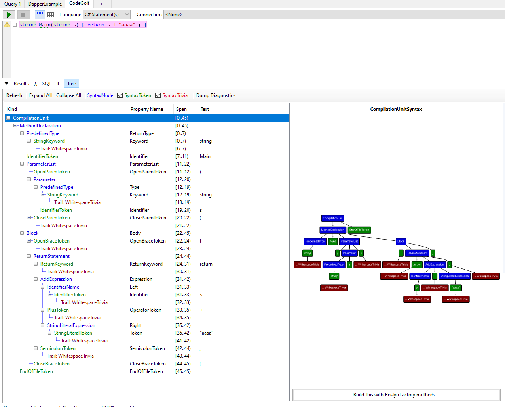
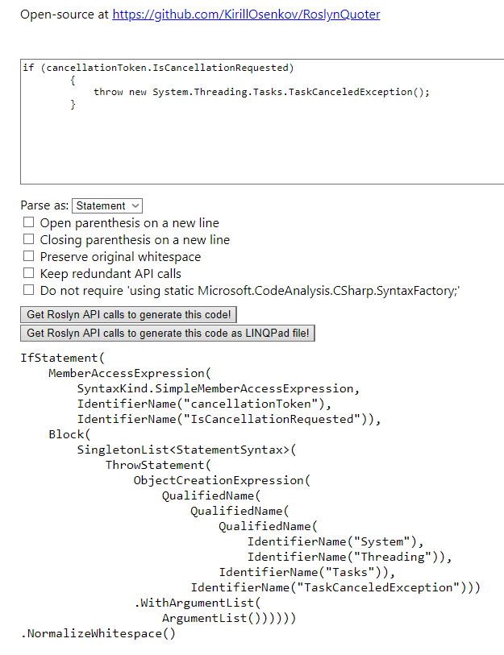

# Creating Roslyn Analysers

"It's Easy"

---

## What is Roslyn

- Parsing of code into ASTs
- Modification of ASTs
  - Key difference from CodeDOM
- Generation of Semantic models
- Compilation into Executables

---

## Demo

1. CodeGolf
2. Dapper Plugin

---

## Example Project

Find Dapper SQL strings and ensure consistent formatting

---

## Find Your Target Code

Write a simple project exhibiting your problem

Apply AST Viewer to your source to inspect the structure

Build code to find target

---

---

## Generate AST Modifier

Use Roslyn Code Quoter to generate something like what you want to replace the code

<https://roslynquoter.azurewebsites.net>

Check for trivia around your code

---

---

## Test, Test, Test

There are many different ways to write the same thing in modern C#

An arrow function is not the same a traditional function

Write tests to cover all the different versions you find

---

## TL;DR

It's easy but fiddly

---

## Further Reading

C# In a Nutshell - Joe Albahari (Mr. LinqPad)

Channel 9 "Learn Roslyn Now" Video Series
